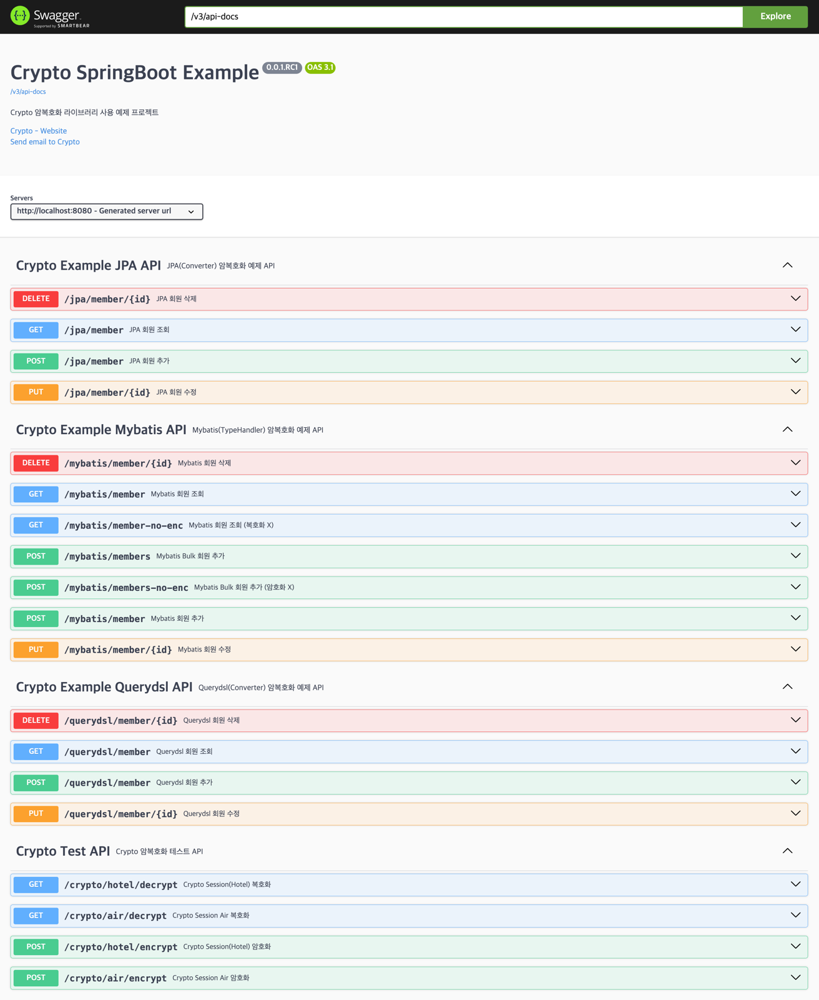
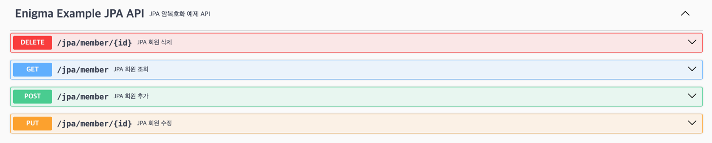
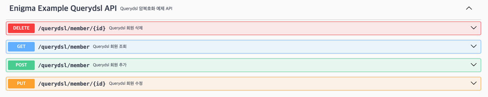
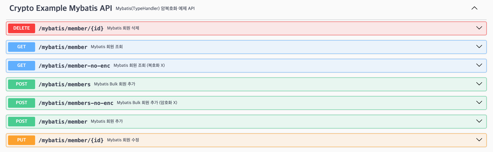
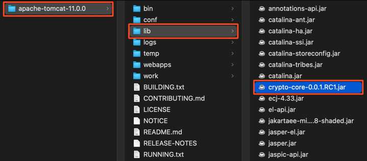
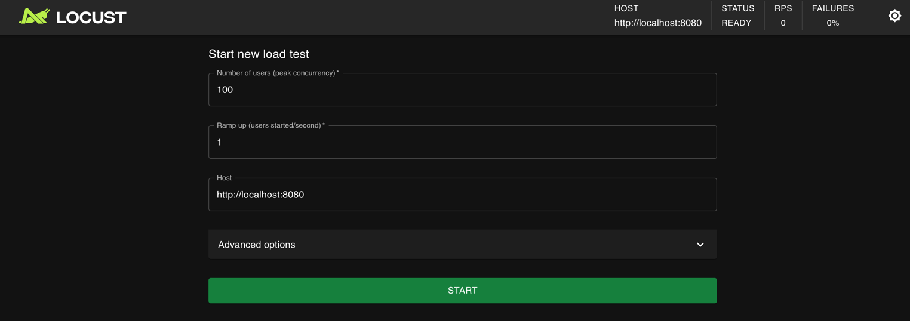
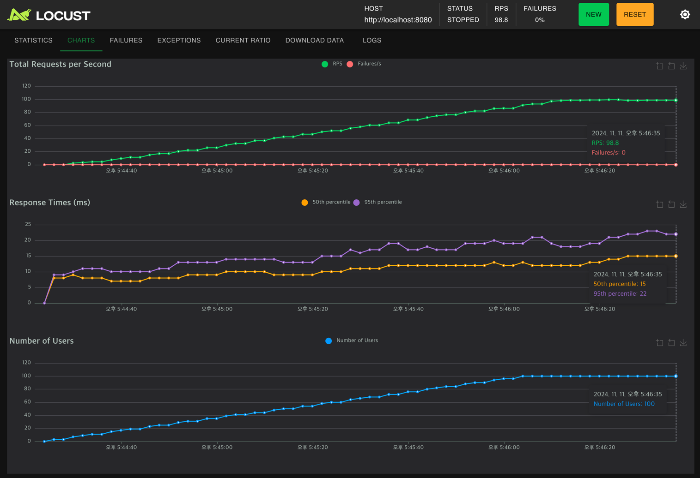

# Crypto SpringBoot Example

---


<!-- TOC -->
* [Crypto SpringBoot Example](#crypto-springboot-example)
  * [🚦 0. 소개](#-0-소개)
  * [🚦 1. 시작하기](#-1-시작하기)
    * [📌 Swagger API Docs](#-swagger-api-docs)
    * [📌 지원 가능한 OS 및 JDK 버전](#-지원-가능한-os-및-jdk-버전)
    * [📌 Crypto Repository 저장소 추가 및 의존성 추가](#-crypto-repository-저장소-추가-및-의존성-추가)
      * [► **Gradle(LOCAL 타입)**](#-gradlelocal-타입)
      * [► **Maven(LOCAL 타입)**](#-mavenlocal-타입)
      * [► **Gradle(AWS 타입)**](#-gradleaws-타입)
      * [► **Maven(AWS 타입)**](#-mavenaws-타입)
  * [🚦 2. Crypto 설정](#-2-crypto-설정)
    * [📌 Crypto `config.json` 설정 파일](#-crypto-configjson-설정-파일)
      * [▶︎ CryptoSession 기본 경로](#-cryptosession-기본-경로)
  * [🚦 3. `CryptoSession` 기본 설정 및 사용 방법](#-3-cryptosession-기본-설정-및-사용-방법)
    * [📌 `CryptoSession` 기본 사용 방법](#-cryptosession-기본-사용-방법)
    * [📌 `CryptoSession` 객체 초기화를 위한 설정 방법](#-cryptosession-객체-초기화를-위한-설정-방법)
      * [▶︎ 1. 프로젝트 ClassPath 경로에 위치한 `config.json` 파일을 사용](#-1-프로젝트-classpath-경로에-위치한-configjson-파일을-사용)
      * [▶︎ 2. `config.json` 파일을 바이트 배열로 변환하여 사용](#-2-configjson-파일을-바이트-배열로-변환하여-사용)
      * [▶︎ 3. `config.json` 파일을 `InputStream` 으로 변환하여 사용](#-3-configjson-파일을-inputstream-으로-변환하여-사용)
      * [▶︎ 4. `config.json` 파일을 `Map` 으로 변환하여 사용](#-4-configjson-파일을-map-으로-변환하여-사용)
      * [▶︎ 5. `config.json` 파일을 파라메터로 전달하여 사용](#-5-configjson-파일을-파라메터로-전달하여-사용)
  * [🚦 4. `CryptoSession` `Bean` 설정 및 사용 방법](#-4-cryptosession-bean-설정-및-사용-방법)
    * [📌 `CryptoSession` 단일 `Bean` 설정 방법](#-cryptosession-단일-bean-설정-방법)
    * [📌 `CryptoSession` 다중 `Bean` 설정 방법](#-cryptosession-다중-bean-설정-방법)
      * [▶︎ `CryptoSession` `Bean` 사용 방법](#-cryptosession-bean-사용-방법)
  * [🚦 5. JPA 사용 예제](#-5-jpa-사용-예제)
    * [📌 JPA Crypto 암복호화 처리를 위한 Converter 구현](#-jpa-crypto-암복호화-처리를-위한-converter-구현)
    * [📌 JPA Entity 속성에 Converter 적용](#-jpa-entity-속성에-converter-적용)
  * [🚦 6. Querydsl 사용 예제](#-6-querydsl-사용-예제)
  * [🚦 7. Mybatis 사용 예제](#-7-mybatis-사용-예제)
    * [📌 Mybatis Crypto 암복호화 처리를 위한 `TypeHandler` 구현](#-mybatis-crypto-암복호화-처리를-위한-typehandler-구현)
    * [📌 Mybatis Mapper 설정에 TypeHandler 적용](#-mybatis-mapper-설정에-typehandler-적용)
  * [🚦 8. 외장 톰캣 배포시 구성 방법](#-8-외장-톰캣-배포시-구성-방법)
    * [📌 외장 톰캣 배포시 Crypto 라이브러리 추가](#-외장-톰캣-배포시-crypto-라이브러리-추가)
    * [📌 배포용 war 빌드시 Crypto 라이브러리 제외](#-배포용-war-빌드시-crypto-라이브러리-제외)
      * [▶︎ Gradle](#-gradle)
      * [▶︎ Maven](#-maven)
  * [🚦 9. Locust 부하 테스트](#-9-locust-부하-테스트)
* [번외 - `CryptoSession` Factory 설정 및 사용 방법](#번외---cryptosession-factory-설정-및-사용-방법)
  * [🚦 1. `CryptoSessionInit<T extends Enum<T>>` 타입별 초기화 객체 사용 방법](#-1-cryptosessioninitt-extends-enumt-타입별-초기화-객체-사용-방법)
    * [📌 `CryptoSessionInit<T extends Enum<T>>` 구현](#-cryptosessioninitt-extends-enumt-구현)
    * [📌 `CryptoSessionInit<T extends Enum<T>>` 객체 초기화 방법](#-cryptosessioninitt-extends-enumt-객체-초기화-방법)
      * [► 1.  BASE_PATH `CryptoSessionInit` 초기화 예시](#-1-base_path-cryptosessioninit-초기화-예시)
      * [► 2.  BYTES `CryptoSessionInit` 초기화 예시](#-2-bytes-cryptosessioninit-초기화-예시)
      * [► 3.  INPUT_STREAM `CryptoSessionInit` 초기화 예시](#-3-input_stream-cryptosessioninit-초기화-예시)
      * [► 4.  PATH `CryptoSessionInit` 초기화 예시](#-4-path-cryptosessioninit-초기화-예시)
      * [► 5.  MAP `CryptoSessionInit` 초기화 예시](#-5-map-cryptosessioninit-초기화-예시)
      * [► 6.  PARAMS `CryptoSessionInit` 초기화 예시](#-6-params-cryptosessioninit-초기화-예시)
      * [► 5.  LOCAL_MAP `CryptoSessionInit` 초기화 예시](#-5-local_map-cryptosessioninit-초기화-예시)
      * [► 6.  LOCAL_PARAMS `CryptoSessionInit` 초기화 예시](#-6-local_params-cryptosessioninit-초기화-예시)
  * [🚦 2. `CryptoSessionFactory<T extends Enum<T>>` 클래스 구현 및 설정 방법](#-2-cryptosessionfactoryt-extends-enumt-클래스-구현-및-설정-방법)
    * [📌 `CryptoSessionFactory<T extends Enum<T>>` 구성 및 `CryptoSession` 다중 `Bean` 설정 방법](#-cryptosessionfactoryt-extends-enumt-구성-및-cryptosession-다중-bean-설정-방법)
    * [📌 `CryptoSessionFactory<T extends Enum<T>>` 사용 방법](#-cryptosessionfactoryt-extends-enumt-사용-방법)
  * [🚦 3. `CryptoSessionFactoryBean<T extends Enum<T>>` 클래스 구현 및 설정 방법](#-3-cryptosessionfactorybeant-extends-enumt-클래스-구현-및-설정-방법)
    * [📌 `CryptoSessionFactoryBean<T extends Enum<T>>` 구성 및 `CryptoSession` 다중 `Bean` 설정 방법](#-cryptosessionfactorybeant-extends-enumt-구성-및-cryptosession-다중-bean-설정-방법)
    * [📌 `CryptoSessionFactoryBean<T extends Enum<T>>` 사용 방법](#-cryptosessionfactorybeant-extends-enumt-사용-방법)
<!-- TOC -->


## 🚦 0. 소개

---

**Crypto 암복호화 라이브러리**는 DB 암호화 솔루션 외부 공개용 프로젝트로 개발된 라이브러리 이며 비공개 버전은 AWS KMS 와 AES 암호화 알고리즘을 조합한 3중 암호화 방식을 적용하여 데이터를 안전하게 암복호화 하는 라이브러리이다

외부 공개용으로 수정한 버전에서는 AWS KMS 를 사용하지 않고 AES 암호화 알고리즘만을 사용하여 데이터를 암복호화 한다

설정 내용을 **AWS 타입**과 **LOCAL 타입**으로 구분해놓았으니 외부 공개용 버전을 사용할 때는 **LOCAL 타입**으로 설정하여 사용하면 된다

또한 **Rust**로 개발하여 **JNI(Java Native Interface)** 라이브러리 형태로 제공하여 보안성을 강화한 암복호화 라이브러리이다

본 예제 프로젝트는 **SpringBoot** 프로젝트에서 **Crypto 암복호화 라이브러리**를 설정 및 사용하는 방법을 설명한다

본 예제 프로젝트에서는 아래와 같은 내용을 다룬다

- **Maven**, **Gradle** Build 도구에서 **Crypto 암복호화 라이브러리** 추가하는 방법
- `CryptoSession` 을 설정하고 사용하는 방법
- `CryptoSession` 을 Bean으로 설정하여 사용하는 방법
- `JPA`, `Mybatis`, `Querydsl` 등과 연동하여 사용하는 방법
- 외장 톰캣 서버 배포시 구성 방법

## 🚦 1. 시작하기

---


### 📌 Swagger API Docs

Application 구동 후 아래의 URL 로 접속

- URL: http://localhost:8080/docs

**Crypto 암복호화 테스트 용 Swagger API Docs 제공**




### 📌 지원 가능한 OS 및 JDK 버전

- **OS**
  - Windows x86_64
  - MacOS Apple Silicon(M1 이상)
  - Linux x86_64
  - Linux AArch64(ARM64)
- **JDK**
  - JDK 11 이상
  - JDK 1.8 이상 (별도로 제공)


### 📌 Crypto Repository 저장소 추가 및 의존성 추가

`AWS` 타입의 경우 **Crypto Repository 저장소**는 **AWS S3**로 제공되며 `AWS_ACCESS_KEY_ID` 와 `AWS_SECRET_ACCESS_KEY` 를 사용하여 접근이 가능하므로  
**Gradle** 및 **Maven** 설정 파일에 해당 정보를 추가하여 사용할 수 있다

`LOCAL` 타입의 경우는 **Crypto Repository 저장소**는 **Local**로 제공되며 `libs` 폴더에 `crypto.jar` 파일을 추가하여 사용할 수 있다

아래의 이유로 `JDK 1.8` 버전과 `JDK 11` 이상 버전을 구분하여 제공함

`JDK 11` 이상에서는 아래의 이유로 **deprecated** 된 `finalize` 메소드를 제거 하고    
`JDK 9`에서 추가된 `Cleaner` 와 `AutoCloseable` 인터페이스를 구현하여 리소스 정리 방식을 개선하였다

> finalize 를 제거한 이유:  
> Finalizer 는 예측할 수 없고, 상황에 따라 위험할 수 있어 불필요하며, 오작동, 낮은 성능, 이식성 문제의 원인으로 기본적으로는 쓰지 말아야 한다

#### ► **Gradle(LOCAL 타입)**

`LOCAL` 타입의 경우는 Local Library 로 제공되므로 `libs` 폴더에 `crypto.jar` 파일을 추가하고 `build.gradle` 설정에 추가하여 사용할 수 있다

**build.gradle** 설정

- `build.gradle` 설정 참고: [${projectDir}/build.gradle](build.gradle)

```groovy
repositories {
  mavenCentral()
  flatDir { dirs 'libs' } // Local JAR 파일이 있는 디렉토리명 입력
}
```

**dependencies** 에 `crypto-core` **Dependency** 추가

```groovy
dependencies {
    // Crypto Local Library
    implementation fileTree(dir: 'libs', include: ['*.jar'])
}
```

#### ► **Maven(LOCAL 타입)**

`LOCAL` 타입의 경우는 Local Library 로 제공되므로 `libs` 폴더에 `crypto.jar` 파일을 추가하고 `pom.xml` 설정에 추가하여 사용할 수 있다

**pom.xml** 설정

- `pom.xml` 설정 참고: [${projectDir}/pom.xml](pom.xml)

`repositories` 태그에 **Crypto Repository 저장소** 추가

```xml
<repositories>
  <repository>
    <id>local-libs</id>
    <url>file://${project.basedir}/libs</url>
  </repository>
</repositories>
```

`dependencies` 태그에 `crypto-core` **Dependency** 추가

```xml
<dependency>
  <groupId>com.freelife.crypto</groupId>
  <artifactId>crypto-lib</artifactId>
  <version>1.0.0</version>
  <scope>system</scope>
  <systemPath>${project.basedir}/libs/crypto.jar</systemPath>
</dependency>
```

#### ► **Gradle(AWS 타입)**

아래의 경로 중 하나의 `gradle.properties` 파일 내에 **Crypto Repository 저장소**의 `awsAccessKeyId` 와 `awsSecretAccessKey` 를 추가

- `~/.gradle/gradle.properties`
- `$projectDir/gradle.properties`
- `$projectDir/gradle/wrapper/gradle-wrapper.properties`


**build.gradle** 설정

- `build.gradle` 설정 참고: [${projectDir}/build.gradle](build.gradle)

```groovy
repositories {
    mavenCentral()
    maven {
        url "s3://crypto-dev-repo"
        credentials(AwsCredentials) {
            // ### Gradle.properties 에 등록된 값 사용 ### 
            accessKey "$awsAccessKeyId"
            secretKey "$awsSecretAccessKey"
            // ### 직접 입력 ###
            // accessKey 'AXXXXXXXXXXXXXXXXXXX'
            // secretKey '53gXXXXXXXXXXXXXXXXXXXXXXXXXXXXXXXXXXXXX'
            // ### Gradle Build 시 Property로 전달 (사용 예: -PawsAccessKeyId=AX -PawsSecretAccessKey=53gXXX ) ###
            // accessKey = project.findProperty("awsAccessKeyId")
            // secretKey = project.findProperty("awsSecretAccessKey")
            // ### 시스템 환경변수 사용 ###
            // accessKey System.getenv("$awsAccessKeyId")
            // secretKey System.getenv("$awsSecretAccessKey")
        }
    }
}
```

**dependencies** 에 `crypto-core` **Dependency** 추가

```groovy
dependencies {
    // Crypto
    // JDK 9 이상에서 사용
    implementation 'com.freelife.crypto:crypto-core:0.0.2.RC1'
    // JDK 1.8 에서 사용
    // implementation 'com.freelife.crypto:crypto-core-jdk1.8:0.0.2.RC1'
}
```

#### ► **Maven(AWS 타입)**

##### 📒 Environment Variable 설정 방법

Maven Build 시 환경 변수 설정이 필요하다

설정을 위해 몇가지 방법을 소개 한다

자신의 환경에 맞는 방법을 골라 한가지만 선택하여 사용하면 된다

###### **1. Maven Settings 파일에 설정**

IntelliJ **Build, Execution, Deployment > Build Tools > Maven > Runner > Environment Variables** 설정에

아래의 환경 변수를 추가

- `AWS_REGION`=ap-northeast-2

`~/.m2/settings.xml` 파일에 **Enigma Repository 저장소**의   
`username` 에는 `AWS_ACCESS_KEY_ID` 를, `password` 에는 `AWS_SECRET_ACCESS_KEY` 를 추가

```xml
<?xml version="1.0" encoding="UTF-8"?>
<settings xmlns="http://maven.apache.org/SETTINGS/1.0.0"
          xmlns:xsi="http://www.w3.org/2001/XMLSchema-instance" xsi:schemaLocation="http://maven.apache.org/SETTINGS/1.0.0 http://maven.apache.org/xsd/settings-1.0.0.xsd">
    <servers>
        <server>
            <id>crypto-dev-repo</id>
            <username>AXXXXXXXXXXXXXXXXXXX</username>
            <password>53gXXXXXXXXXXXXXXXXXXXXXXXXXXXXXXXXXXXXX</password>
        </server>
    </servers>
</settings>
```

###### **2. IntelliJ IDEA 에서 Maven Build 환경 변수 설정**

IntelliJ **Build, Execution, Deployment > Build Tools > Maven > Runner > Environment Variables** 설정에

아래의 환경 변수를 추가

- `AWS_REGION`=ap-northeast-2
- `AWS_ACCESS_KEY_ID`=AXXXXXXXXXXXXXXXXXXX
- `AWS_SECRET_ACCESS_KEY`=53gXXXXXXXXXXXXXXXXXXXXXXXXXXXXXXXXXXXXX


###### **3. Command로 Maven Build 시 환경 변수 설정**

```shell
$ ./mvnw clean install -DskipTests -DAWS_REGION=ap-northeast-2 -DAWS_ACCESS_KEY_ID=AXXXXXXXXXXXXXXXXXXX -DAWS_SECRET_ACCESS_KEY=53gXXXXXXXXXXXXXXXXXXXXXXXXXXXXXXXXXXXXX
````

##### 📒 `pom.xml` 설정

- `pom.xml` 설정 참고: [${projectDir}/pom.xml](pom.xml)

`build` 태그 내에 **AWS S3 Repository** 저장소를 사용하기 위한 **Extension** 추가

```xml
<build>
    <extensions>
        <!-- AWS S3 Repository 사용을 위한 Extension -->
        <extension>
            <groupId>com.github.platform-team</groupId>
            <artifactId>aws-maven</artifactId>
            <version>6.0.0</version>
        </extension>
    </extensions>
</build>
```

`repositories` 태그에 **Crypto Repository 저장소** 추가

```xml
<repositories>
    <repository>
        <id>crypto-dev-repo</id>
        <name>Crypto AWS S3 Repository</name>
        <url>s3://crypto-dev-repo</url>
    </repository>
</repositories>
```

`dependencies` 태그에 `crypto-core` **Dependency** 추가

```xml
<!-- JDK 9 이상에서 사용 -->
<dependency>
    <groupId>com.freelife.crypto</groupId>
    <artifactId>crypto-core</artifactId>
    <version>0.0.1.RC1</version>
</dependency>
<!-- JDK 1.8에서 사용 -->
<!-- 
<dependency>
    <groupId>com.freelife.crypto</groupId>
    <artifactId>crypto-core-jdk1.8</artifactId>
    <version>0.0.1.RC1</version>
</dependency>
-->
```


## 🚦 2. Crypto 설정

---

**Crypto 암복호화 라이브러리**를 사용하기 위해서는 `CryptoSession` 객체를 설정파일로 초기화하고 사용해야 한다

`CryptoSession` 인스턴스는 `config.json` 설정 파일을 읽어들여 암복호화에 필요한 정보를 설정하고 사용한다


### 📌 Crypto `config.json` 설정 파일

`config.json` 파일은 **Crypto 암복호화 라이브러리**의 설정 파일로 암복호화에 필요한 정보를 설정한다  
`config.json` 파일은 **Crypto 암복호화 라이브러리**의 `CryptoSession`을 사용하기 위한 필수 설정 파일로  
기본 경로에 위치시키거나 파라메터로 전달하여 사용할 수 있다

Crypto **config.json** 파일은 사내 프로젝트용으로 진행한 `AWS` 타입과 `LOCAL` 타입 두가지가 있다

`AWS` 타입은 아래와 같은 속성들로 구성되어 있다

- `aws_kms_key_arn`: **AWS KMS Key ARN**
- `aws_access_key_id`: **AWS KMS**에 접근하기 위한 **AWS Access Key ID**
- `aws_secret_access_key`: **AWS KMS**에 접근하기 위한 **AWS Secret Access Key**
- `seed`: Crypto 암복호화 수행 시 필요한 **Seed**
- `credential`: Crypto 암복호화 수행 시 필요한 **Credential**

`LOCAL` 타입은 아래와 같은 속성들로 구성되어 있다

- `key`: **이중 암호화 처리를 위한 핵심 Secret Key**
- `iv`: **이중 암호화 처리를 위한 핵심 초기화 백터(Initialization Vector)**
- `seed`: Crypto 암복호화 수행 시 필요한 **Seed**
- `credential`: Crypto 암복호화 수행 시 필요한 **Credential**

#### ▶︎ CryptoSession 기본 경로

별도의 설정 파라메터를 넘겨주지 않으면 기본 경로에 위치한 `config.json` 파일을 사용한다

현재 지원되는 기본 경로는 아래와 같다

- `${projectDir}/crypto/config.json`
- `/var/opt/crypto/config.json`


## 🚦 3. `CryptoSession` 기본 설정 및 사용 방법

---

이번 챕터에서는 `Bean` 설정 없이 `CryptoSession` 객체를 설정하고 사용하는 방법을 설명한다

> **CryptoSession 사용시에는 반드시 `CryptoSession` 객체를 `Bean`으로 설정하여 사용하기 바란다**  
> **CryptoSession 객체 초기화시 최초 1회 AWS KMS와 통신을 하게 되는데 `Bean`으로 설정하지 않으면 반복적으로 객체 초기화를 시도하여**      
> **매번 AWS KMS 와 통신을 하게 되어 성능에도 문제가 되고 비용적인 측면에서도 비효율적이므로 반드시 `Bean`으로 설정하여 사용하기를 권장한다**

**Crypto 암복호화 라이브러리**를 사용하기 위해서는 `CryptoSession` 객체 생성 후 설정 정보로 초기화하고 사용해야 한다

**CryptoSession 객체 초기화**는 **CryptoSession 설정 파일**인 `config.json` 파일을 특정 경로에 위치 시키거나 파라메터로 전달하여 사용할 수 있다

- 사용 예제 코드: [${projectDir}/src/test/java/com/freelife/config/CryptoSessionTest.java](src/test/java/com/freelife/config/CryptoSessionTest.java)


### 📌 `CryptoSession` 기본 사용 방법

아래의 예시는 **기본 경로**(`${projectDir}/crypto/config.json`)에 있는 설정 정보로 객체를 초기화하고    
**Crypto 암복호화 라이브러리**를 사용하여 문자열을 암복호화 하는 간단한 예시이다

```java
// CryptoSession 객체 생성 및 기본 경로(${projectDir}/crypto/config.json)로 초기화
CryptoSession session = new CryptoSession();
// 암호화할 문자열
String plaintext = "Hello Crypto!";
// 암호화
String encrypt = session.encrypt(plaintext);
// 복호화
String decrypt = session.decrypt(encrypt);
```


### 📌 `CryptoSession` 객체 초기화를 위한 설정 방법

`CryptoSession` 객체 초기화를 위한 파라메터 전달 방식의 설정 방법은 아래와 같다

#### ▶︎ 1. 프로젝트 ClassPath 경로에 위치한 `config.json` 파일을 사용

`resources/crypto/hotel/config.json` **ClassPath** 경로에 있는 파일을 사용하는 예시

```java
Resource resource = new ClassPathResource(Path.of("crypto", "hotel", "config.json").toString());
CryptoSession session = new CryptoSession(resource.getFile().getPath());
```

#### ▶︎ 2. `config.json` 파일을 바이트 배열로 변환하여 사용

`config.json` 파일을 바이트 배열로 변환하여 사용하는 예시

```java
ClassPathResource resource = new ClassPathResource(Path.of("crypto", "hotel", "config.json").toString());
CryptoSession session = new CryptoSession(resource.getInputStream().readAllBytes());
```

#### ▶︎ 3. `config.json` 파일을 `InputStream` 으로 변환하여 사용

`config.json` 파일을 `InputStream` 으로 변환하여 사용하는 예시

```java
ClassPathResource resource = new ClassPathResource(Path.of("crypto", "hotel", "config.json").toString());
CryptoSession session = new CryptoSession(resource.getInputStream());
```

#### ▶︎ 4. `config.json` 파일을 `Map` 으로 변환하여 사용

`config.json` 파일을 `Map` 으로 변환하여 사용하는 `AWS` 타입 예시

```java
String awsKmsKeyArn = "arn:aws:kms:ap-northeast-2:123456789012:key/12345678-1234-1234-1234-123456789012";
String awsAccessKeyId = "AXXXXXXXXXXXXXXXXXXX;
String awsSecretAccessKey = "53gXXXXXXXXXXXXXXXXXXXXXXXXXXXXXXXXXXXXX;
String seed = "AXXXXXXXXXXXXXXXXXX";
String credential = "BXXXXXXXXXXXXXXXXXXXX";
CryptoSession session = new CryptoSession(
        Map.of(
                "aws_kms_key_arn", awsKmsKeyArn,
                "aws_access_key_id", awsAccessKeyId,
                "aws_secret_access_key", awsSecretAccessKey,
                "seed", seed,
                "credential", credential
        )
);
```

`config.json` 파일을 `Map` 으로 변환하여 사용하는 `LOCAL` 타입 예시

```java
String key = "KXXXXXXXXXXXXXXXX";
String iv = "00000000000000000000000000000000;
String seed = "AXXXXXXXXXXXXXXXXXX";
String credential = "BXXXXXXXXXXXXXXXXXXXX";
CryptoSession session = new CryptoSession(
        Map.of(
                "key", key,
                "iv", iv,
                "seed", seed,
                "credential", credential
        )
);
```

#### ▶︎ 5. `config.json` 파일을 파라메터로 전달하여 사용


`config.json` 파일을 파라메터로 전달하여 사용하는 `AWS` 타입 예시

```java
String awsKmsKeyArn = "arn:aws:kms:ap-northeast-2:123456789012:key/12345678-1234-1234-1234-123456789012";
String awsAccessKeyId = "AXXXXXXXXXXXXXXXXXXX;
String awsSecretAccessKey = "53gXXXXXXXXXXXXXXXXXXXXXXXXXXXXXXXXXXXXX;
String seed = "AXXXXXXXXXXXXXXXXXX";
String credential = "BXXXXXXXXXXXXXXXXXXXX";
CryptoSession session = new CryptoSession(awsKmsKeyArn, awsAccessKeyId, awsSecretAccessKey, seed, credential);
```

`config.json` 파일을 파라메터로 전달하여 사용하는 `LOCAL` 타입 예시

```java
String key = "KXXXXXXXXXXXXXXXX";
String iv = "00000000000000000000000000000000;
String seed = "AXXXXXXXXXXXXXXXXXX";
String credential = "BXXXXXXXXXXXXXXXXXXXX";
CryptoSession session = new CryptoSession(key, iv, seed, credential);
```

다시 한번 강조하자면 **Crypto 라이브러리**는 **JNI 라이브러리**로 작성되어 있어 메모리 누수가 발생할 수 있으므로  
반드시 `CryptoSession` 인스턴스를 `Bean`으로 설정하여 사용하기를 권장한다  
또한 `CryptoSession` 인스턴스 최초 생성시 **AWS KMS**와 통신을 하는데 `Bean`으로 설정하지 않으면 매번 통신을 하게 되어 성능에도 문제가 되고  
비용적인 측면에서도 비효율적이므로 반드시 `Bean`으로 설정하여 사용하기를 권장한다


## 🚦 4. `CryptoSession` `Bean` 설정 및 사용 방법

---

> `CryptoSession` 객체를 `Bean`으로 설정하여 사용하면 **객체 초기화로 인한 AWS KMS 반복 호출이나 성능 이슈** 없이  
> **Crypto 암복호화 라이브러리**를 효율적으로 사용할 수 있으므로 반드시 `Bean`으로 설정하여 사용하기를 권장한다

자세한 사용법은 아래의 코드를 참고하기 바란다

- 설정 예시 코드:  [${projectDir}/src/main/java/com/freelife/config/CryptoConfig.java](src/main/java/com/freelife/config/CryptoConfig.java)


### 📌 `CryptoSession` 단일 `Bean` 설정 방법

기본 경로 `${projectDir}/crypto/config.json`에 위치한 `config.json` 파일을 사용하는 `CryptoSession` `Bean` 설정 예시

```java
@Configuration
public class CryptoConfig {

    @Bean
    @Scope(value = ConfigurableBeanFactory.SCOPE_SINGLETON)
    public CryptoSession cryptoSession() throws Exception {
        return new CryptoSession();
    }

}
```


### 📌 `CryptoSession` 다중 `Bean` 설정 방법

`CryptoSession` 객체를 다중으로 사용할 경우 `@Primary` 어노테이션을 사용하여 기본 `Bean`을 설정해 `Bean` 생성 충돌을 방지한다    
같은 타입의 다중 `Bean` 사용시에는 `@Qualifier`, `@Resource` 어노테이션을 사용해 `Bean`을 선택하여 사용할 수 있다


```java
@Configuration
public class CryptoConfig {

    @Primary
    @Bean
    @Scope(value = ConfigurableBeanFactory.SCOPE_SINGLETON)
    public CryptoSession cryptoSession() throws Exception {
        return new CryptoSession();
    }

    @Bean
    @Scope(value = ConfigurableBeanFactory.SCOPE_SINGLETON)
    public CryptoSession secondCryptoSession() {
        Resource resource = new ClassPathResource(Path.of("crypto", "hotel", "config.json").toString());
        return new CryptoSession(resource.getFile().getPath());
    }

}
```

#### ▶︎ `CryptoSession` `Bean` 사용 방법

- 사용 예제 코드: [${projectDir}/src/test/java/com/freelife/config/CryptoConfigTest.java](src/test/java/com/freelife/config/CryptoConfigTest.java)

`CryptoSession` Bean을 사용하는 방법은 아래와 같다

```java
@SpringBootTest(webEnvironment = SpringBootTest.WebEnvironment.RANDOM_PORT)
class CryptoFactoryConfigTest {

    // @Autowired: 필드 타입을 기준으로 빈을 찾음
    // @Resource: 필드 이름을 기준으로 빈을 찾음
    // 지정된 bean 이름으로 사용하기 위해서 `@Resource` 어노테이션을 사용하여 Bean을 찾아 사용할 수 있다
    @Resource
    private CryptoSession cryptoSession;
    @Resource
    private CryptoSession secondCryptoSession;

    @Test
    void base_Initializing_cryptoSession() {
        String plaintext = "Hello Crypto!";
        String encrypt = cryptoSession.encrypt(plaintext);
        String decrypt = cryptoSession.decrypt(encrypt);
        String encryptHotel = secondCryptoSession.encrypt(plaintext);
        String decryptHotel = secondCryptoSession.decrypt(encryptHotel);
    }
}
```


## 🚦 5. JPA 사용 예제

--- 

Swagger API Docs 의 JPA Example API 코드 참고



JPA 에서 **Entity**의 특정 속성을 암복호화 하기 위해서 **Converter** 를 구현하여 사용 할 수 있다


### 📌 JPA Crypto 암복호화 처리를 위한 Converter 구현

JPA 에서 **Crypto 라이브러리**를 **Converter** 로 사용하기 위해서는 `@Converter` 어노테이션을 사용하여 `AttributeConverter` 를 구현해야 한다

- Converter 구현 코드: [${projectDir}/src/main/java/com/freelife/repository/converter/CryptoConverter.java](src/main/java/com/freelife/repository/converter/CryptoConverter.java)

```java
@RequiredArgsConstructor
@Converter
public class CryptoConverter implements AttributeConverter<String, String> {

    @Resource
    private final CryptoSession basicCryptoSession;

    /**
     * 엔티티 -> DB 시 데이터 변환
     * Base64 인코딩
     * @param value
     * @return
     */
    @Override
    public String convertToDatabaseColumn(String value) {
        if (StringUtils.isEmpty(value)) return value;
        String encrypt = basicCryptoSession.encrypt(value);
        log.debug("[Crypto] Converter Encrypt : {}", encrypt);
        return encrypt;
    }

    /**
     * DB -> 엔티티 시 데이터 변환
     * @param value
     * @return
     */
    @Override
    public String convertToEntityAttribute(String value) {
        if (StringUtils.isEmpty(value)) return value;
        String decrypt = basicCryptoSession.decrypt(value);
        log.debug("[Crypto] Converter Decrypt : {}", decrypt);
        return decrypt;
    }

}
```


### 📌 JPA Entity 속성에 Converter 적용

JPA **Entity** 에 **Converter** 를 적용하기 위해서는 `@Convert` 어노테이션을 사용하여 **Converter** 를 지정해야 한다

- Entity 속성에 Converter 적용 코드: [${projectDir}/src/main/java/com/freelife/domain/Member.java](src/main/java/com/freelife/domain/Member.java)

```java
@Data
@Entity
@NoArgsConstructor
public class Member {
    
    ...

    /**
     * CryptoConverter 를 사용하여 암복호화 처리
     */
    @Convert(converter = CryptoConverter.class)
    private String password;

    ...

}
```


## 🚦 6. Querydsl 사용 예제

---

Swagger API Docs 의 Querydsl Example API 코드 참고



Querydsl 은 JPA 구성과 동일하여 추가 설명은 생략한다


## 🚦 7. Mybatis 사용 예제

---

Swagger API Docs 의 Mybatis Example API 코드 참고



Mybatis 는 `TypeHandler` 를 구현하고 **Mapper** 에 적용하여 **Crypto 라이브러리**를 사용해서 특정 속성을 암복호화 시킬 수 있다


### 📌 Mybatis Crypto 암복호화 처리를 위한 `TypeHandler` 구현

Mybatis 에서 **Crypto 라이브러리**를 사용하기 위해서는 `TypeHandler` 를 구현해야 한다

- TypeHandler 구현 코드: [${proejctDir}/src/main/java/com/freelife/repository/mybatis/CryptoHandler.java](src/main/java/com/freelife/repository/mybatis/CryptoHandler.java)

```java
@Component
public class CryptoHandler implements TypeHandler<String> {

    @Resource
    private CryptoSession basicCryptoSession;

    public String encrypt(String value) {
        if (StringUtils.isEmpty(value)) return value;
        String encrypt = basicCryptoSession.encrypt(value);
        log.debug("[Crypto] Converter Encrypt : {}", encrypt);
        return encrypt;
    }

    public String decrypt(String value) {
        if (StringUtils.isEmpty(value)) return value;
        String decrypt = basicCryptoSession.decrypt(value);
        log.debug("[Crypto] Converter Decrypt : {}", decrypt);
        return decrypt;
    }

    @Override
    public void setParameter(PreparedStatement ps, int i, String parameter, JdbcType jdbcType) throws SQLException {
        if ( StringUtils.isNotEmpty(parameter) )
            parameter = encrypt(parameter);
        ps.setString(i, parameter);
    }

    @Override
    public String getResult(ResultSet rs, String columnName) throws SQLException {
        return decrypt(rs.getString(columnName));
    }

    @Override
    public String getResult(ResultSet rs, int columnIndex) throws SQLException {
        return decrypt(rs.getString(columnIndex));
    }

    @Override
    public String getResult(CallableStatement cs, int columnIndex) throws SQLException {
        return decrypt(cs.getString(columnIndex));
    }
}
```


### 📌 Mybatis Mapper 설정에 TypeHandler 적용

Mybatis **Mapper** 에서 **Crypto 라이브러리**를 사용하기 위해서는 `TypeHandler` 를 지정해야 한다

- Mapper 설정 코드: [${proejctDir}/src/main/resources/mapper/MemberMapper.xml](src/main/resources/mapper/MemberMapper.xml)

```xml
<?xml version="1.0" encoding="UTF-8" ?>
<!DOCTYPE mapper PUBLIC "-//mybatis.org//DTD Mapper 3.0//EN" "http://mybatis.org/dtd/mybatis-3-mapper.dtd">
<mapper namespace="com.freelife.repository.mybatis.MemberMapper">

    <resultMap id="member" type="Member">
        <id property="id" column="id"/>
        <result property="name" column="name"/>
        <result property="nickName" column="nick_name"/>
        <result property="password" column="password" typeHandler="CryptoHandler"/>
        <result property="encPassword" column="enc_password" typeHandler="CryptoNoDecHandler"/>
    </resultMap>

    <insert id="save" parameterType="Member" useGeneratedKeys="true"
            keyProperty="id" keyColumn="id">
        INSERT INTO member (name, nick_name, password, enc_password)
        VALUES (#{member.name},
        #{member.nickName},
        #{member.password, typeHandler=CryptoHandler},
        #{member.encPassword, typeHandler=CryptoNoDecHandler});
    </insert>

    <update id="update" parameterType="Member">
        UPDATE member
        SET name = #{member.name},
        nick_name = #{member.nickName},
        password = #{member.password, typeHandler=CryptoHandler},
        enc_password = #{member.encPassword, typeHandler=CryptoNoDecHandler}
        WHERE id = #{member.id};
    </update>

</mapper>
```


## 🚦 8. 외장 톰캣 배포시 구성 방법

---

**JNI 라이브러리** 사용시에는 아래와 같은 문제가 발생할 수 있어 Tomcat 전체를 재시작하여 **JVM**을 종료하고,  
네이티브 라이브러리 및 리소스를 완전히 정리하는 것이 좋지만 **Context Reload**로 서비스를 운영하고자 한다면 별도의 추가 작업이 필요하다

- 네이티브 라이브러리 언로드(Native Library Unload) 이슈
- 리소스 누수(Resource Leak)
- 객체 상태 불일치(Object State Inconsistency)
- 다중 클래스 로더 문제(Multiple Class Loader Issue)

위의 문제들을 해결하기 위해 빌드 도구에서는 **JNI 라이브러리**를 제외하고 **외장 톰캣 라이브러리** 폴더에 직접 추가 해야 한다


### 📌 외장 톰캣 배포시 Crypto 라이브러리 추가

`$TOMCAT_HOME/lib` 폴더에 `crypto-core-0.0.1.RC1.jar` 파일을 직접 추가




### 📌 배포용 war 빌드시 Crypto 라이브러리 제외

#### ▶︎ Gradle

외장 톰캣에 배포시 `build.gradle` 파일에 `complieOnly` 설정을 추가하여 라이브러리를 제외하고 배포할 수 있다

```groovy
dependencies {
    compileOnly 'com.freelife.crypto:crypto-core:0.0.1.RC1'
    testCompileOnly 'com.freelife.crypto:crypto-core:0.0.1.RC1'
}
```

#### ▶︎ Maven

외장 톰캣에 배포시 `pom.xml` 파일에 `provided` 설정을 추가하여 라이브러리를 제외하고 배포할 수 있다

```xml
<dependency>
    <groupId>com.freelife.crypto</groupId>
    <artifactId>crypto-core</artifactId>
    <version>0.0.1.RC1</version>
    <scope>provided</scope>
</dependency>
```

## 🚦 9. Locust 부하 테스트

---

부하 테스트는 `locust` 툴로 테스트

```shell
# locust 테스트에 필요한 패키지 설치
$ brew install python
$ brew install locust

# 아래의 명령으로 테스트
$ locust -f ./find-all.py --host=https://localhost:8080
[2024-11-11 17:41:49,492] home/INFO/locust.main: Starting Locust 2.32.2
[2024-11-11 17:41:49,493] home/INFO/locust.main: Starting web interface at http://0.0.0.0:8089
```





- 테스트에 사용한 locust 스크립트 참고: [test_locust_script](locust/locustfile.py)
- 참고
    - https://locust.io/
    - https://cheese10yun.github.io/locust-part-1/
    - https://cheese10yun.github.io/locust-part-2/

---

# 번외 - `CryptoSession` Factory 설정 및 사용 방법

---

## 🚦 1. `CryptoSessionInit<T extends Enum<T>>` 타입별 초기화 객체 사용 방법

---

`CryptoSessionInit<T extends Enum<T>>` 객체는 다중 `CryptoSession` 객체를 타입세이프하게 생성하기 위한 초기화 클래스로
`CryptoSessionFactory`, `CryptoSessionFactoryBean`, `CryptoSessionImpl` 클래스를 사용하여 다중 `CryptoSession` 객체를 초기화할 경우   
편리한 초기 설정을 돕고자 만들어졌다


### 📌 `CryptoSessionInit<T extends Enum<T>>` 구현

- CryptoSessionInit 구현 예시 코드: [${proejctDir}/src/main/java/com/freelife/factory/CryptoSessionInit.java](src/main/java/com/freelife/factory/CryptoSessionInit.java)
- CryptoSessionType Enum 클래스 구현 예시 코드: [${proejctDir}/src/main/java/com/freelife/factory/CryptoSessionType.java](src/main/java/com/freelife/factory/CryptoSessionType.java)

`CryptoSessionInit` 객체는 `CryptoSession` 에서 가능한 총 8가지 타입(`BASE_PATH`, `BYTES`, `INPUT_STREAM`, `PATH`, `MAP`, `PARAMS`, `LOCAL_MAP`, `LOCAL_PARAMS`)의  
`CryptoSession` 객체를 초기화할 수 있는 메서드를 제공한다

`CryptoSessionInit` 객체 사용을 위해 각 서비스에서 사용할 `CryptoSessionType` **Enum 클래스**를 커스텀하게 생성하여 타입을 지정해야 된다

`CryptoSessionType` 생성 예시

```java
public enum CryptoSessionType {
    HOTEL, // 호텔 서비스용 CryptoSession 타입
    AIR, // 항공 서비스용 CryptoSession 타입
    TOACT // TOACT 서비스용 CryptoSession 타입
}
```


### 📌 `CryptoSessionInit<T extends Enum<T>>` 객체 초기화 방법

설정하는 방법은 위에서 설명한 `CryptoSession` 객체 초기화를 위한 설정 방법과 비슷하므로 타입별 메서드를 사용하는 방법만 참고하면 된다

- 사용 예제 코드:  [${proejctDir}/src/test/java/com/freelife/factory/CryptoSessionInitTest.java](src/main/java/com/freelife/factory/CryptoSessionInit.java)

#### ► 1.  BASE_PATH `CryptoSessionInit` 초기화 예시

`BASE_PATH` 타입은 기본 설정 타입으로 단일 DB를 사용하는 경우에는 아래의 기본 경로에 `config.json` 파일을 위치시키고 사용할 수 있다

현재 지원되는 기본 경로는 아래와 같다

- `${projectDir}/crypto/config.json`
- `/var/opt/crypto/config.json`

`CryptoSession` 객체 초기화시 별도의 파라메터를 넘겨주지 않으면 기본 경로에 위치한 `config.json` 파일을 사용한다  
만약 기본 경로에 위치한 `config.json` 파일이 존재하지 않으면 에러가 발생하므로 기본 경로 타입으로 설정시  
반드시 기본 경로에 `config.json` 파일을 생성 후 사용하기 바란다

```java
CryptoSessionInit<CryptoSessionType> basePathInit = CryptoSessionInit.ofBasePath(CryptoSessionType.HOTEL);
```

#### ► 2.  BYTES `CryptoSessionInit` 초기화 예시

`BYTES` 타입은 `config.json` 파일을 바이트 배열로 변환하여 사용하는 타입이다

```java
ClassPathResource resource = new ClassPathResource(Path.of("crypto", "hotel", "config.json").toString());
CryptoSessionInit<CryptoSessionType> bytesInit = CryptoSessionInit.ofBytes(
        CryptoSessionType.HOTEL,
        resource.getInputStream().readAllBytes()
);
```

#### ► 3.  INPUT_STREAM `CryptoSessionInit` 초기화 예시

`INPUT_STREAM` 타입은 `config.json` 파일을 `InputStream` 으로 변환하여 사용하는 타입이다

```java
ClassPathResource resource = new ClassPathResource(Path.of("crypto", "hotel", "config.json").toString());
CryptoSessionInit<CryptoSessionType> inputStreamInit = CryptoSessionInit.ofInputStream(
        CryptoSessionType.HOTEL,
        resource.getInputStream()
);
```

#### ► 4.  PATH `CryptoSessionInit` 초기화 예시

`PATH` 타입은 `config.json` 파일의 경로를 지정하여 사용하는 타입이다

```java
Resource resource = new ClassPathResource(Path.of("crypto", "hotel", "config.json").toString());
CryptoSessionInit<CryptoSessionType> pathInit = CryptoSessionInit.ofPath(
        CryptoSessionType.HOTEL,
        resource.getFile().getPath()
);
```

#### ► 5.  MAP `CryptoSessionInit` 초기화 예시

`MAP` 타입은 설정 정보를 `Map` 으로 변환하여 사용하는 타입이다

```java
String awsKmsKeyArn = "arn:aws:kms:ap-northeast-2:123456789012:key/12345678-1234-1234-1234-123456789012";
String awsAccessKeyId = "AXXXXXXXXXXXXXXXXXXX;
String awsSecretAccessKey = "53gXXXXXXXXXXXXXXXXXXXXXXXXXXXXXXXXXXXXX;
String seed = "AXXXXXXXXXXXXXXXXXX";
String credential = "BXXXXXXXXXXXXXXXXXXXX";
CryptoSessionInit<CryptoSessionType> mapInit = CryptoSessionInit.ofMap(
        CryptoSessionType.HOTEL,
        Map.of(
                "aws_kms_key_arn", awsKmsKeyArn,
                "aws_access_key_id", awsAccessKeyId,
                "aws_secret_access_key", awsSecretAccessKey,
                "seed", seed,
                "credential", credential
        )
);
```

#### ► 6.  PARAMS `CryptoSessionInit` 초기화 예시

`PARAMS` 타입은 설정 정보를 파라메터로 전달하여 사용하는 타입이다

```java
String awsKmsKeyArn = "arn:aws:kms:ap-northeast-2:123456789012:key/12345678-1234-1234-1234-123456789012";
String awsAccessKeyId = "AXXXXXXXXXXXXXXXXXXX;
String awsSecretAccessKey = "53gXXXXXXXXXXXXXXXXXXXXXXXXXXXXXXXXXXXXX;
String seed = "AXXXXXXXXXXXXXXXXXX";
String credential = "BXXXXXXXXXXXXXXXXXXXX";
CryptoSessionInit<CryptoSessionType> paramsInit = CryptoSessionInit.ofParams(
        CryptoSessionType.HOTEL,
        awsKmsKeyArn, awsAccessKeyId, awsSecretAccessKey, seed, credential
);
```

#### ► 5.  LOCAL_MAP `CryptoSessionInit` 초기화 예시

`LOCAL_MAP` 타입은 설정 정보를 AWS 정보를 제외하고 `key`, `iv`를 포함해 `Map` 으로 변환하여 사용하는 타입이다

```java
String key = "KXXXXXXXXXXXXXXXX";
String iv = "00000000000000000000000000000000;
String seed = "AXXXXXXXXXXXXXXXXXX";
String credential = "BXXXXXXXXXXXXXXXXXXXX";
CryptoSessionInit<CryptoSessionType> mapInit = CryptoSessionInit.ofLocalMap(
        CryptoSessionType.HOTEL,
        Map.of(
                "key", key,
                "iv", iv,
                "seed", seed,
                "credential", credential
        )
);
```

#### ► 6.  LOCAL_PARAMS `CryptoSessionInit` 초기화 예시

`LOCAL_PARAMS` 타입은 LOCAL 설정 정보를 파라메터로 전달하여 사용하는 타입이다

```java
String key = "KXXXXXXXXXXXXXXXX";
String iv = "00000000000000000000000000000000;
String seed = "AXXXXXXXXXXXXXXXXXX";
String credential = "BXXXXXXXXXXXXXXXXXXXX";
CryptoSessionInit<CryptoSessionType> paramsInit = CryptoSessionInit.ofLocalParams(
        CryptoSessionType.HOTEL,
        key, iv, seed, credential
);
```


## 🚦 2. `CryptoSessionFactory<T extends Enum<T>>` 클래스 구현 및 설정 방법

---

`CryptoSessionFactory<T extends Enum<T>>` 는 `CryptoSessionInit<T extends Enum<T>>` 객체를 사용하여 `CryptoSession` 다중 `Bean` 설정을 지원하기 위한 **Factory** 클래스이다

자세한 사용법은 아래의 코드를 참고하기 바란다


### 📌 `CryptoSessionFactory<T extends Enum<T>>` 구성 및 `CryptoSession` 다중 `Bean` 설정 방법

- CryptoSessionFactory 구현 예시 코드: [${proejctDir}/src/main/java/com/freelife/factory/CryptoSessionFactory.java](src/main/java/com/freelife/factory/CryptoSessionFactory.java)
- 설정 예시 코드: [${proejctDir}/src/main/java/com/freelife/factory/CryptoFactoryConfig.java](src/main/java/com/freelife/factory/CryptoFactoryConfig.java)

```java
public enum CryptoSessionType {
    HOTEL, // 호텔 서비스용 CryptoSession 타입
    AIR, // 항공 서비스용 CryptoSession 타입
    TOACT // TOACT 서비스용 CryptoSession 타입
}

@Configuration
public class CryptoFactoryConfig {

    @Bean
    public CryptoSessionFactory<CryptoSessionType> cryptoSessionFactory() {
        Resource hotelConfig = new ClassPathResource(Path.of("crypto", "hotel", "config.json").toString());
        Resource airConfig = new ClassPathResource(Path.of("crypto", "air", "config.json").toString());
        List<CryptoSessionInit<CryptoSessionType>> cryptoSessionInits = List.of(
                // HOTEL CryptoSession 생성
                CryptoSessionInit.ofPath(CryptoSessionType.HOTEL, hotelConfig.getFile().getPath()),
                // AIR CryptoSession 생성
                CryptoSessionInit.ofPath(CryptoSessionType.AIR, airConfig.getFile().getPath())
        );
        return new CryptoSessionFactory<>(cryptoSessionInits);
    }

}
```


### 📌 `CryptoSessionFactory<T extends Enum<T>>` 사용 방법

- 사용 예제 코드: [${proejctDir}/src/test/java/com/freelife/factory/CryptoFactoryConfigTest.java](src/test/java/com/freelife/factory/CryptoFactoryConfigTest.java)

```java
@SpringBootTest(webEnvironment = SpringBootTest.WebEnvironment.RANDOM_PORT)
class CryptoFactoryConfigTest {

    // @Autowired: 필드 타입을 기준으로 빈을 찾음
    // @Resource: 필드 이름을 기준으로 빈을 찾음
    // 지정된 bean 이름으로 사용하기 위해서 `@Resource` 어노테이션을 사용하여 Bean을 찾아 사용할 수 있다
    @Resource
    private CryptoSessionFactory<CryptoSessionType> cryptoSessionFactory;

    @Test
    void cryptoSessionFactoryTest() {
        String plainText = "Hello Crypto!";
        // HOTEL CryptoSession 사용
        CryptoSession hotelCryptoSession = cryptoSessionFactory.of(CryptoSessionType.HOTEL);
        // AIR CryptoSession 사용
        CryptoSession airCryptoSession = cryptoSessionFactory.of(CryptoSessionType.AIR);
        // HOTEL CryptoSession 암복호화
        String encryptHotel = hotelCryptoSession.encrypt(plainText);
        String decryptHotel = hotelCryptoSession.decrypt(encryptHotel);
        // AIR CryptoSession 암복호화
        String encryptAir = airCryptoSession.encrypt(plainText);
        String decryptAir = airCryptoSession.decrypt(encryptAir);
    }
}
```


## 🚦 3. `CryptoSessionFactoryBean<T extends Enum<T>>` 클래스 구현 및 설정 방법

---

`CryptoSessionFactoryBean<T extends Enum<T>>` 는 **SpringFramework** 의 `AbstractFactoryBean<T>` 추상 클래스를 상속받아
쉽게 **FactoryBean** 구현할 수 있도록 도와주는 클래스이다

**Crypto 암복호화 라이브러리**에서는 종속성 문제로 인해 직접 제공하지 않고 사용을 위해서는 별도의 구성이 필요하다

자세한 사용법은 아래의 코드를 참고하기 바란다


### 📌 `CryptoSessionFactoryBean<T extends Enum<T>>` 구성 및 `CryptoSession` 다중 `Bean` 설정 방법

- `CryptoSessionFactoryBean` 구현 예시 코드: [${proejctDir}/src/main/java/com/freelife/factory/factorybean/CryptoSessionFactoryBean.java](src/main/java/com/freelife/factory/factorybean/CryptoSessionFactoryBean.java)
- `CryptoSessions` 구현 예시 코드: [${proejctDir}/src/main/java/com/freelife/factory/factorybean/CryptoSessions.java](src/main/java/com/freelife/factory/factorybean/CryptoSessions.java)
- 설정 예시 코드: [${proejctDir}/src/main/java/com/freelife/factory/factorybean/CryptoFactoryBeanConfig.java](src/main/java/com/freelife/factory/factorybean/CryptoFactoryBeanConfig.java)

`AbstractFactoryBean<T>` 추상 클래스를 상속받아 Crypto 객체 초기화를 위한 `CryptoSessionFactoryBean` 클래스를 구성

```java
public class CryptoSessionFactoryBean<T extends Enum<T>> extends AbstractFactoryBean<CryptoSession> {

    private CryptoSessionInit<T> cryptoSessionInit;

    CryptoSessionFactoryBean(CryptoSessionInit<T> cryptoSessionInit) {
        this.cryptoSessionInit = cryptoSessionInit;
    }

    @Override
    public Class<?> getObjectType() {
        return CryptoSession.class;
    }

    @Override
    protected CryptoSession createInstance() throws Exception {
        log.info("Initialize CryptoSession FactoryBean: {}: {}",cryptoSessionInit.getCryptoSessionType(),  cryptoSessionInit.getInitType());
        return CryptoSession.of(cryptoSessionInit);
    }

    public static <T extends Enum<T>> CryptoSessionFactoryBean<T> of(CryptoSessionInit<T> cryptoSessionInit) {
        if (cryptoSessionInit == null)
            throw new IllegalArgumentException("CryptoSessionInit must not be null");
        return new CryptoSessionFactoryBean<>(cryptoSessionInit);
    }

}
```

다중 `CryptoSession` 객체를 저장하기 위한 `CryptoSessions` 객체 생성

```java
@Data
@NoArgsConstructor
@AllArgsConstructor
public class CryptoSessions<T extends Enum<T>> {
    private Map<T, CryptoSession> cryptoSessionMap = new HashMap<>();

    private CryptoSession hotelCryptoSession;
    private CryptoSession airCryptoSession;
}
```

`CryptoSessionFactoryBean` 클래스를 사용하여 `CryptoSessionFactory` Bean 과 `CryptoSessions` Bean 설정

```java
@Configuration
@RequiredArgsConstructor
public class CryptoFactoryBeanConfig {

    private final CryptoProperties cryptoProperties;

    /**
     * Hotel CryptoSession Bean 생성
     * FactoryBean 타입으로 리턴하지만 실제 사용시에는 CryptoSession 타입으로 사용
     * ex1: @Resource(name = "hotelCryptoSession") CryptoSession hotelCryptoSession;
     * ex2: @Autowired CryptoSession hotelCryptoSession;
     */
    @Bean
    public CryptoSessionFactoryBean<CryptoSessionType> hotelCryptoSession() throws IOException {
        ClassPathResource classPathResource = new ClassPathResource(cryptoProperties.getHotel().getPath());
        return CryptoSessionFactoryBean.of(
                CryptoSessionInit.ofInputStream(
                        CryptoSessionType.HOTEL,
                        classPathResource.getInputStream()));
    }

    /**
     * Air CryptoSession Bean 생성
     * FactoryBean 타입으로 리턴하지만 실제 사용시에는 CryptoSession 타입으로 사용
     * ex1: @Resource(name = "airCryptoSession") CryptoSession airCryptoSession;
     * ex2: @Autowired CryptoSession airCryptoSession;
     */
    @Bean
    public CryptoSessionFactoryBean<CryptoSessionType> airCryptoSession() throws IOException {
        ClassPathResource classPathResource = new ClassPathResource(cryptoProperties.getAir().getPath());
        return CryptoSessionFactoryBean.of(
                CryptoSessionInit.ofBytes(
                        CryptoSessionType.AIR,
                        classPathResource.getInputStream().readAllBytes()));
    }

    /**
     * 생성된 FactoryBean 을 CryptoSessions 에 등록하여 다중 세션을 관리
     */
    @Bean
    public CryptoSessions<CryptoSessionType> cryptoSessions() throws Exception {
        CryptoSessions<CryptoSessionType> cryptoSessions = new CryptoSessions<>();
        cryptoSessions.setHotelCryptoSession(hotelCryptoSession().getObject());
        cryptoSessions.setAirCryptoSession(airCryptoSession().getObject());
        return cryptoSessions;
    }
}
```


### 📌 `CryptoSessionFactoryBean<T extends Enum<T>>` 사용 방법

- 사용 예제 코드: [${proejctDir}/src/test/java/com/freelife/factory/CryptoFactoryBeanConfigTest.java](src/test/java/com/freelife/config/CryptoFactoryBeanConfigTest.java)

```java
@SpringBootTest(webEnvironment = SpringBootTest.WebEnvironment.RANDOM_PORT)
class CryptoFactoryBeanConfigTest {

    @Resource
    private CryptoSession hotelCryptoSession;

    @Resource
    private CryptoSession airCryptoSession;

    @Resource
    private CryptoSessions<CryptoSessionType> cryptoSessions;

    @Test
    void CryptoFactoryBeanHotelTest() {
        String plainText = "Hello Crypto!";
        // HOTEL CryptoSession(FactoryBean) 사용
        String encrypt = hotelCryptoSession.encrypt(plainText);
        String decrypt = hotelCryptoSession.decrypt(encrypt);
    }

    @Test
    void CryptoFactoryBeanAirTest() {
        String plainText = "Hello Crypto!";
        // AIR CryptoSession(FactoryBean) 사용
        String encrypt = airCryptoSession.encrypt(plainText);
        String decrypt = airCryptoSession.decrypt(encrypt);
    }

    @Test
    void cryptoSessionsTest() {
        String plainText = "Hello Crypto!";
        // HOTEL CryptoSession(CryptoSessions) 사용
        String encryptHotel = cryptoSessions.getHotelCryptoSession().encrypt(plainText);
        String decryptHotel = cryptoSessions.getHotelCryptoSession().decrypt(encryptHotel);
        // AIR CryptoSession(CryptoSessions) 사용
        String encryptAir = cryptoSessions.getAirCryptoSession().encrypt(plainText);
        String decryptAir = cryptoSessions.getAirCryptoSession().decrypt(encryptAir);
    }
}
```