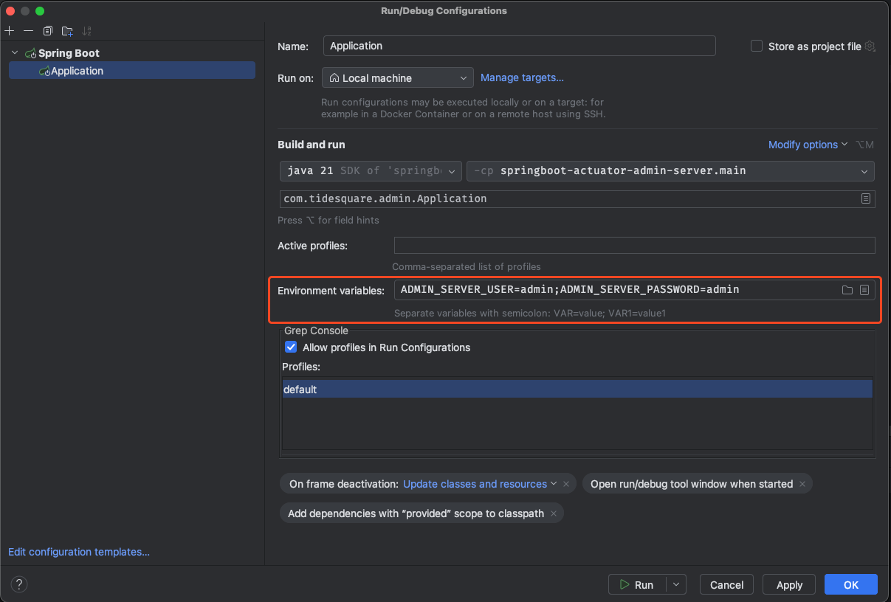
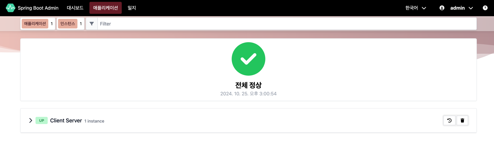
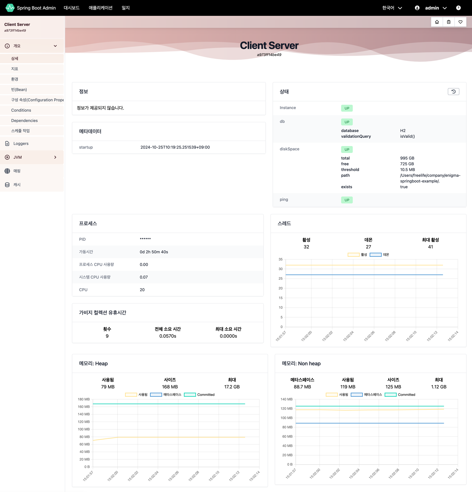
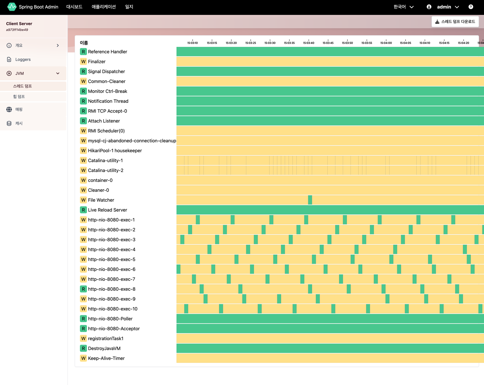
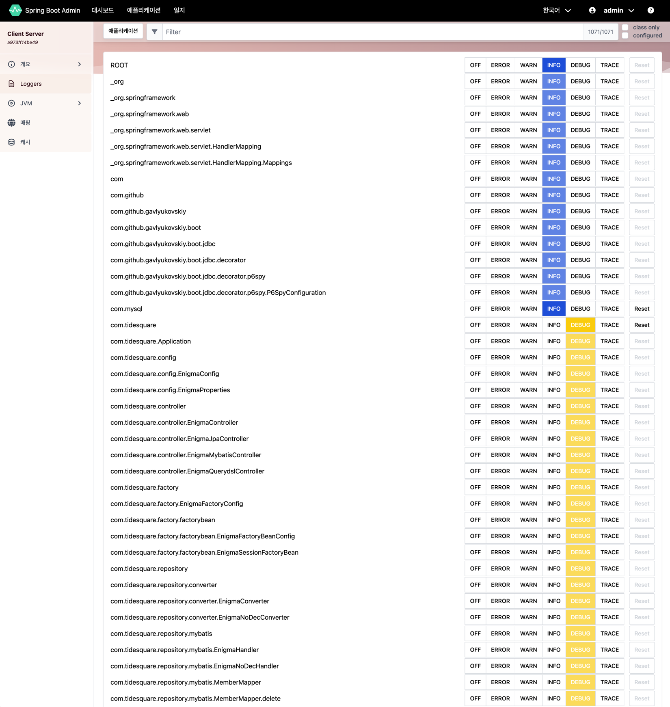

# SpringBoot Actuator Admin Server

---

**Spring Boot Admin**은 **Spring Boot Actuator**에서 제공하는 정보를 보기 좋게 접근 가능한 방식으로 시각화하는 것을 목표로 하는 모니터링 도구이다 

security 설정을 통해 모니터링 정보에 아무나 접근할 수 없도록 할 수 있다

**Spring Boot Admin**은 두 가지 주요 부분으로 구성된다

- **Server** : **Spring Boot Actuator**를 표시하고 상호 작용하기 위한 사용자 인터페이스를 제공하는 서버
- **Client** : 서버에 등록하고 `actuator` 엔드포인트에 액세스하는데 사용되는 클라이언트

### 📌 Spring Boot Admin 참고 문서

- [Spring Boot Admin Docs](https://docs.spring-boot-admin.com/)
- [Actuator endpoint Docs](https://docs.spring.io/spring-boot/reference/actuator/endpoints.html#actuator.endpoints)
- [Actuator 안전하게 사용하기](https://techblog.woowahan.com/9232/)
- [Spring Boot 프로젝트 모니터링 하기](https://velog.io/@ncookie/Spring-Boot-%ED%94%84%EB%A1%9C%EC%A0%9D%ED%8A%B8-%EB%AA%A8%EB%8B%88%ED%84%B0%EB%A7%81-%ED%95%98%EA%B8%B0)
- [Spring Boot Admin 적용하기](https://velog.io/@ncookie/Spring-Boot-Admin-%EC%A0%81%EC%9A%A9%ED%95%98%EA%B8%B0)

## 🚦 Spring Boot Admin Server 접속 정보

---

- Spring Boot Admin URL: http://localhost:8090
- ID: admin
- Password: admin

### 📌 IntelliJ 환경 변수 설정

- `Run/Debug Configuration` > `Environment Variables` 에 아래와 같이 설정

- `ADMIN_SERVER_USERNAME=admin`
- `ADMIN_SERVER_PASSWORD=admin`

## 🚦 Spring Boot Admin 스크린샷

---

